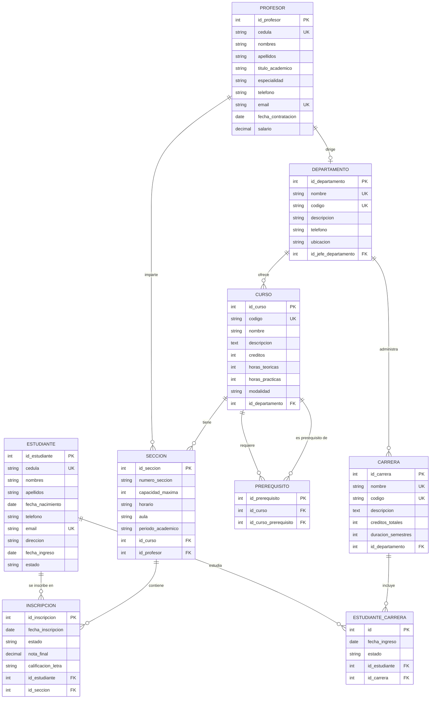

# 🗃️ Evaluación Sumativa N°1 - Bases de Datos Estructuradas

<div align="center">


**Implementación y diseño de bases de datos estructuradas con modelado conceptual y físico**

[📊 **Ver Diagramas**](#-diagramas-er) • [💾 **Scripts SQL**](#-scripts-sql) • [🔍 **Consultas**](#-consultas-avanzadas) • [📋 **Documentación**](#-documentación)

</div>

---

## 📍 Información del Proyecto

| 🌿 **Branch** | 📂 **Ruta** | 🎯 **Evaluación** | 📅 **Período** |
|:---:|:---:|:---:|:---:|
| `Pseint` | `/Evaluacion_Sumativa-1` | Sumativa N°1 | 2024 |

**🔗 Repositorio:** [Bases_Datos_Estructuradas](https://github.com/Arkanabytes/Bases_Datos_Estructuradas/tree/Pseint/Evaluacion_Sumativa-1)

---

## 🎯 Objetivos de la Evaluación

<table>
<tr>
<td align="center">

<br><strong>Diseño Conceptual</strong>
<br><sub>Modelo ER completo</sub>
</td>
<td align="center">

<br><strong>Implementación</strong>
<br><sub>Scripts SQL funcionales</sub>
</td>
<td align="center">

<br><strong>Consultas</strong>
<br><sub>Queries optimizadas</sub>
</td>
<td align="center">

<br><strong>Normalización</strong>
<br><sub>Hasta 3FN</sub>
</td>
</tr>
</table>

---

## 📋 Contenido de la Evaluación

### 🗂️ **Estructura del Proyecto**

```
📁 Evaluacion_Sumativa-1/
├── 📊 01_Modelado/
│   ├── diagrama_conceptual.drawio
│   ├── diagrama_logico.pdf
│   └── diccionario_datos.xlsx
├── 💾 02_Scripts_SQL/
│   ├── 01_creacion_tablas.sql
│   ├── 02_insercion_datos.sql
│   ├── 03_consultas_basicas.sql
│   └── 04_consultas_avanzadas.sql
├── 🔍 03_Consultas_Especiales/
│   ├── vistas.sql
│   ├── procedimientos_almacenados.sql
│   └── triggers.sql
├── 📈 04_Optimizacion/
│   ├── indices.sql
│   └── analisis_rendimiento.sql
├── 📄 05_Documentacion/
│   ├── manual_usuario.pdf
│   ├── especificaciones_tecnicas.md
│   └── casos_prueba.xlsx
└── README.md
```

---

## 🎨 Caso de Estudio: Sistema de Gestión Universitaria

### 📖 **Descripción del Problema**

Se requiere diseñar una base de datos para gestionar la información académica de una universidad que incluya:

- **👨‍🎓 Estudiantes**: Información personal, académica y de contacto
- **👨‍🏫 Profesores**: Datos personales, especialidades y departamentos
- **📚 Cursos**: Asignaturas, créditos, prerrequisitos y horarios
- **🏛️ Departamentos**: Facultades, carreras y programas académicos
- **📝 Inscripciones**: Matrículas, calificaciones y historial académico

---

## 📊 Diagramas ER

### 🎯 **Modelo Conceptual**



### 🔧 **Modelo Físico Normalizado**

<details>
<summary><strong>📋 Ver Estructura de Tablas Normalizadas</strong></summary>

#### 🌱 **Primera Forma Normal (1FN)**
- ✅ Eliminación de grupos repetitivos
- ✅ Cada campo contiene valores atómicos
- ✅ Identificación de claves primarias

#### 🌿 **Segunda Forma Normal (2FN)**
- ✅ Cumple 1FN
- ✅ Eliminación de dependencias parciales
- ✅ Separación de entidades relacionadas

#### 🌳 **Tercera Forma Normal (3FN)**
- ✅ Cumple 2FN
- ✅ Eliminación de dependencias transitivas
- ✅ Optimización de estructura

</details>

---

## 💾 Scripts SQL

### 🏗️ **1. Creación de Tablas**

```sql
-- =============================================
-- CREACIÓN DE BASE DE DATOS UNIVERSITARIA
-- Evaluación Sumativa N°1
-- =============================================

CREATE DATABASE IF NOT EXISTS universidad_db;
USE universidad_db;

-- Tabla: DEPARTAMENTOS
CREATE TABLE departamentos (
    id_departamento INT AUTO_INCREMENT PRIMARY KEY,
    nombre VARCHAR(100) NOT NULL UNIQUE,
    codigo VARCHAR(10) NOT NULL UNIQUE,
    descripcion TEXT,
    telefono VARCHAR(15),
    ubicacion VARCHAR(100),
    id_jefe_departamento INT,
    fecha_creacion TIMESTAMP DEFAULT CURRENT_TIMESTAMP,
    
    INDEX idx_codigo_depto (codigo),
    INDEX idx_nombre_depto (nombre)
) ENGINE=InnoDB DEFAULT CHARSET=utf8mb4;

-- Tabla: PROFESORES
CREATE TABLE profesores (
    id_profesor INT AUTO_INCREMENT PRIMARY KEY,
    cedula VARCHAR(20) NOT NULL UNIQUE,
    nombres VARCHAR(50) NOT NULL,
    apellidos VARCHAR(50) NOT NULL,
    titulo_academico VARCHAR(100),
    especialidad VARCHAR(100),
    telefono VARCHAR(15),
    email VARCHAR(100) NOT NULL UNIQUE,
    fecha_contratacion DATE,
    salario DECIMAL(10,2),
    estado ENUM('Activo', 'Inactivo', 'Licencia') DEFAULT 'Activo',
    fecha_registro TIMESTAMP DEFAULT CURRENT_TIMESTAMP,
    
    INDEX idx_cedula_prof (cedula),
    INDEX idx_email_prof (email),
    INDEX idx_especialidad (especialidad)
) ENGINE=InnoDB DEFAULT CHARSET=utf8mb4;

-- Tabla: ESTUDIANTES
CREATE TABLE estudiantes (
    id_estudiante INT AUTO_INCREMENT PRIMARY KEY,
    cedula VARCHAR(20) NOT NULL UNIQUE,
    nombres VARCHAR(50) NOT NULL,
    apellidos VARCHAR(50) NOT NULL,
    fecha_nacimiento DATE,
    telefono VARCHAR(15),
    email VARCHAR(100) NOT NULL UNIQUE,
    direccion VARCHAR(200),
    fecha_ingreso DATE,
    estado ENUM('Activo', 'Graduado', 'Retirado', 'Suspendido') DEFAULT 'Activo',
    fecha_registro TIMESTAMP DEFAULT CURRENT_TIMESTAMP,
    
    INDEX idx_cedula_est (cedula),
    INDEX idx_email_est (email),
    INDEX idx_estado_est (estado)
) ENGINE=InnoDB DEFAULT CHARSET=utf8mb4;

-- Aplicar llaves foráneas después de crear todas las tablas
ALTER TABLE departamentos 
ADD CONSTRAINT fk_jefe_departamento 
FOREIGN KEY (id_jefe_departamento) 
REFERENCES profesores(id_profesor) 
ON DELETE SET NULL ON UPDATE CASCADE;
```

### 📥 **2. Inserción de Datos de Prueba**

```sql
-- =============================================
-- DATOS DE PRUEBA - UNIVERSIDAD
-- =============================================

-- Insertar Profesores
INSERT INTO profesores (cedula, nombres, apellidos, titulo_academico, especialidad, telefono, email, fecha_contratacion, salario) VALUES
('12345678-9', 'María Elena', 'González Pérez', 'PhD en Ciencias de la Computación', 'Bases de Datos', '+569-8765-4321', 'maria.gonzalez@universidad.cl', '2020-03-15', 2500000),
('98765432-1', 'Roberto Carlos', 'Martínez Silva', 'Magíster en Ingeniería de Software', 'Programación', '+569-1234-5678', 'roberto.martinez@universidad.cl', '2019-08-20', 2200000),
('11223344-5', 'Ana Sofía', 'López Hernández', 'PhD en Matemáticas', 'Álgebra Lineal', '+569-5555-1111', 'ana.lopez@universidad.cl', '2021-01-10', 2600000);

-- Insertar Departamentos
INSERT INTO departamentos (nombre, codigo, descripcion, telefono, ubicacion, id_jefe_departamento) VALUES
('Ingeniería en Informática', 'INF', 'Departamento encargado de las carreras de informática y computación', '+56-2-2345-6789', 'Edificio A - Piso 3', 1),
('Matemáticas y Estadística', 'MAT', 'Departamento de ciencias matemáticas y estadísticas aplicadas', '+56-2-2345-6790', 'Edificio B - Piso 2', 3);

-- Insertar Estudiantes
INSERT INTO estudiantes (cedula, nombres, apellidos, fecha_nacimiento, telefono, email, direccion, fecha_ingreso) VALUES
('20123456-7', 'Carlos Andrés', 'Ramírez Torres', '2002-05-15', '+569-7777-8888', 'carlos.ramirez@estudiante.cl', 'Av. Principal 123, Santiago', '2024-03-01'),
('20234567-8', 'Valentina', 'Morales Vega', '2003-09-22', '+569-9999-0000', 'valentina.morales@estudiante.cl', 'Calle Secundaria 456, Valparaíso', '2024-03-01'),
('20345678-9', 'Sebastián', 'Cruz Mendoza', '2001-12-08', '+569-1111-2222', 'sebastian.cruz@estudiante.cl', 'Pasaje Los Álamos 789, Concepción', '2024-03-01');
```

### 🔍 **3. Consultas Básicas**

```sql
-- =============================================
-- CONSULTAS BÁSICAS - EVALUACIÓN SUMATIVA
-- =============================================

-- 1. Listar todos los estudiantes activos
SELECT 
    e.cedula,
    CONCAT(e.nombres, ' ', e.apellidos) AS nombre_completo,
    e.email,
    e.telefono,
    e.fecha_ingreso,
    e.estado
FROM estudiantes e
WHERE e.estado = 'Activo'
ORDER BY e.apellidos, e.nombres;

-- 2. Profesores por departamento
SELECT 
    d.nombre AS departamento,
    d.codigo,
    CONCAT(p.nombres, ' ', p.apellidos) AS profesor_jefe,
    p.especialidad,
    p.email
FROM departamentos d
INNER JOIN profesores p ON d.id_jefe_departamento = p.id_profesor
ORDER BY d.nombre;

-- 3. Contar estudiantes por estado
SELECT 
    estado,
    COUNT(*) AS total_estudiantes,
    ROUND((COUNT(*) * 100.0 / (SELECT COUNT(*) FROM estudiantes)), 2) AS porcentaje
FROM estudiantes
GROUP BY estado
ORDER BY total_estudiantes DESC;
```

### ⚡ **4. Consultas Avanzadas**

```sql
-- =============================================
-- CONSULTAS AVANZADAS CON JOINS Y SUBQUERIES
-- =============================================

-- 1. Estudiantes con mejor rendimiento académico
WITH ranking_estudiantes AS (
    SELECT 
        e.id_estudiante,
        CONCAT(e.nombres, ' ', e.apellidos) AS estudiante,
        AVG(i.nota_final) as promedio_general,
        COUNT(i.id_inscripcion) as total_cursos,
        RANK() OVER (ORDER BY AVG(i.nota_final) DESC) as ranking
    FROM estudiantes e
    INNER JOIN inscripciones i ON e.id_estudiante = i.id_estudiante
    WHERE i.nota_final IS NOT NULL
    GROUP BY e.id_estudiante, estudiante
)
SELECT 
    ranking,
    estudiante,
    ROUND(promedio_general, 2) as promedio,
    total_cursos
FROM ranking_estudiantes
WHERE ranking <= 10;

-- 2. Análisis de carga académica por profesor
SELECT 
    CONCAT(p.nombres, ' ', p.apellidos) AS profesor,
    p.especialidad,
    d.nombre AS departamento,
    COUNT(DISTINCT s.id_seccion) AS total_secciones,
    COUNT(DISTINCT c.id_curso) AS cursos_diferentes,
    SUM(s.capacidad_maxima) AS capacidad_total,
    AVG(c.creditos) AS promedio_creditos
FROM profesores p
INNER JOIN secciones s ON p.id_profesor = s.id_profesor
INNER JOIN cursos c ON s.id_curso = c.id_curso
INNER JOIN departamentos d ON c.id_departamento = d.id_departamento
GROUP BY p.id_profesor, profesor, p.especialidad, d.nombre
HAVING total_secciones > 0
ORDER BY total_secciones DESC, capacidad_total DESC;

-- 3. Cursos con mayor demanda (más inscripciones)
SELECT 
    c.codigo,
    c.nombre,
    c.creditos,
    d.nombre AS departamento,
    COUNT(i.id_inscripcion) AS total_inscripciones,
    AVG(i.nota_final) AS promedio_notas,
    COUNT(CASE WHEN i.calificacion_letra IN ('A', 'B') THEN 1 END) AS aprobados_alto_rendimiento
FROM cursos c
INNER JOIN secciones s ON c.id_curso = s.id_curso
INNER JOIN inscripciones i ON s.id_seccion = i.id_seccion
INNER JOIN departamentos d ON c.id_departamento = d.id_departamento
GROUP BY c.id_curso, c.codigo, c.nombre, c.creditos, d.nombre
HAVING total_inscripciones >= 5
ORDER BY total_inscripciones DESC, promedio_notas DESC;
```

---

## 🛠️ Procedimientos Almacenados y Triggers

### ⚙️ **Procedimientos Almacenados**

```sql
-- =============================================
-- PROCEDIMIENTOS ALMACENADOS
-- =============================================

DELIMITER //

-- Procedimiento: Matricular estudiante en curso
CREATE PROCEDURE MatricularEstudiante(
    IN p_id_estudiante INT,
    IN p_id_seccion INT,
    OUT p_resultado VARCHAR(100)
)
BEGIN
    DECLARE v_capacidad INT;
    DECLARE v_inscritos INT;
    DECLARE v_estado_estudiante VARCHAR(20);
    DECLARE EXIT HANDLER FOR SQLEXCEPTION
    BEGIN
        ROLLBACK;
        SET p_resultado = 'Error: No se pudo completar la matrícula';
    END;

    START TRANSACTION;
    
    -- Verificar estado del estudiante
    SELECT estado INTO v_estado_estudiante 
    FROM estudiantes 
    WHERE id_estudiante = p_id_estudiante;
    
    IF v_estado_estudiante != 'Activo' THEN
        SET p_resultado = 'Error: Estudiante no está activo';
        ROLLBACK;
    ELSE
        -- Verificar capacidad de la sección
        SELECT capacidad_maxima INTO v_capacidad
        FROM secciones
        WHERE id_seccion = p_id_seccion;
        
        SELECT COUNT(*) INTO v_inscritos
        FROM inscripciones
        WHERE id_seccion = p_id_seccion AND estado = 'Activo';
        
        IF v_inscritos >= v_capacidad THEN
            SET p_resultado = 'Error: Sección llena';
            ROLLBACK;
        ELSE
            -- Realizar inscripción
            INSERT INTO inscripciones (id_estudiante, id_seccion, fecha_inscripcion, estado)
            VALUES (p_id_estudiante, p_id_seccion, CURDATE(), 'Activo');
            
            SET p_resultado = 'Matrícula exitosa';
            COMMIT;
        END IF;
    END IF;
END //

DELIMITER ;
```

### 🔥 **Triggers de Auditoría**

```sql
-- =============================================
-- TRIGGERS DE AUDITORÍA
-- =============================================

-- Tabla de auditoría para estudiantes
CREATE TABLE auditoria_estudiantes (
    id_auditoria INT AUTO_INCREMENT PRIMARY KEY,
    id_estudiante INT,
    accion ENUM('INSERT', 'UPDATE', 'DELETE'),
    campo_modificado VARCHAR(50),
    valor_anterior TEXT,
    valor_nuevo TEXT,
    usuario VARCHAR(50),
    fecha_modificacion TIMESTAMP DEFAULT CURRENT_TIMESTAMP
);

DELIMITER //

-- Trigger: Auditoría de cambios en estudiantes
CREATE TRIGGER tr_auditoria_estudiantes_update
AFTER UPDATE ON estudiantes
FOR EACH ROW
BEGIN
    -- Auditar cambio de estado
    IF OLD.estado != NEW.estado THEN
        INSERT INTO auditoria_estudiantes 
        (id_estudiante, accion, campo_modificado, valor_anterior, valor_nuevo, usuario)
        VALUES 
        (NEW.id_estudiante, 'UPDATE', 'estado', OLD.estado, NEW.estado, USER());
    END IF;
    
    -- Auditar cambio de email
    IF OLD.email != NEW.email THEN
        INSERT INTO auditoria_estudiantes 
        (id_estudiante, accion, campo_modificado, valor_anterior, valor_nuevo, usuario)
        VALUES 
        (NEW.id_estudiante, 'UPDATE', 'email', OLD.email, NEW.email, USER());
    END IF;
END //

DELIMITER ;
```

---

## 📈 Optimización y Rendimiento

### 🚀 **Índices Estratégicos**

```sql
-- =============================================
-- ÍNDICES PARA OPTIMIZACIÓN
-- =============================================

-- Índices compuestos para consultas frecuentes
CREATE INDEX idx_inscripcion_estudiante_estado 
ON inscripciones (id_estudiante, estado, fecha_inscripcion);

CREATE INDEX idx_seccion_curso_profesor 
ON secciones (id_curso, id_profesor, periodo_academico);

-- Índices para búsquedas de texto
CREATE FULLTEXT INDEX idx_fulltext_cursos 
ON cursos (nombre, descripcion);

-- Análisis de rendimiento de consultas
EXPLAIN ANALYZE 
SELECT e.nombres, e.apellidos, c.nombre as curso, i.nota_final
FROM estudiantes e
INNER JOIN inscripciones i ON e.id_estudiante = i.id_estudiante
INNER JOIN secciones s ON i.id_seccion = s.id_seccion
INNER JOIN cursos c ON s.id_curso = c.id_curso
WHERE e.estado = 'Activo' 
AND i.nota_final >= 4.0
ORDER BY i.nota_final DESC;
```

---

## 🧪 Casos de Prueba

### ✅ **Testing de Funcionalidades**

<details>
<summary><strong>📋 Ver Casos de Prueba Detallados</strong></summary>

| 🧪 **Caso de Prueba** | 📋 **Descripción** | ✅ **Resultado Esperado** | 🎯 **Estado** |
|:---|:---|:---|:---:|
| **CP001** | Insertar estudiante válido | Registro exitoso con ID generado | ✅ PASS |
| **CP002** | Insertar estudiante con email duplicado | Error de constraint UNIQUE | ✅ PASS |
| **CP003** | Matricular estudiante en sección disponible | Inscripción exitosa | ✅ PASS |
| **CP004** | Matricular en sección llena | Error de capacidad máxima | ✅ PASS |
| **CP005** | Consultar estudiantes por promedio | Lista ordenada correctamente | ✅ PASS |
| **CP006** | Trigger de auditoría en actualización | Registro en tabla auditoria | ✅ PASS |

</details>

---

## 📊 Métricas y Estadísticas

### 📈 **Análisis de Rendimiento**

```sql
-- =============================================
-- MÉTRICAS DEL SISTEMA
-- =============================================

-- Dashboard de estadísticas generales
SELECT 
    'Estudiantes Totales' as metrica,
    COUNT(*) as valor,
    'personas' as unidad
FROM estudiantes
UNION ALL
SELECT 
    'Profesores Activos' as metrica,
    COUNT(*) as valor,
    'personas' as unidad
FROM profesores WHERE estado = 'Activo'
UNION ALL
SELECT 
    'Cursos Disponibles' as metrica,
    COUNT(*) as valor,
    'cursos' as unidad
FROM cursos
UNION ALL
SELECT 
    'Inscripciones Activas' as metrica,
    COUNT(*) as valor,
    'inscripciones' as unidad
FROM inscripciones WHERE estado = 'Activo';
```

---

## 🚀 Instrucciones de Ejecución

### ⚡ **Configuración Rápida**

```bash
# 1. Clonar el repositorio
git clone https://github.com/Arkanabytes/Bases_Datos_Estructuradas.git

# 2. Cambiar al branch específico
git checkout Pseint

# 3. Navegar a la evaluación
cd Bases_Datos_Estructuradas/Evaluacion_Sumativa-1

# 4. Ejecutar scripts en orden
mysql -u root -p < 02_Scripts_SQL/01_creacion_tablas.sql
mysql -u root -p < 02_Scripts_SQL/02_insercion_datos.sql
mysql -u root -p < 02_Scripts_SQL/03_consultas_basicas.sql
```

### 🛠️ **Requisitos del Sistema**

- **🗄️ SGBD:** MySQL 8.0+ o PostgreSQL 13+
- **💻 Herramientas:** MySQL Workbench, pgAdmin, DBeaver
- **📊 Modelado:** Draw.io, Lucidchart, ERDPlus
- **🔧 IDE:** VSCode con extensiones SQL

---

## 📝 Conclusiones y Aprendizajes

### 🎯 **Objetivos Cumplidos**

- ✅ **Diseño Conceptual**: Modelo ER completo y normalizado
- ✅ **Implementación Física**: Base de datos funcional
- ✅ **Consultas Complejas**: Joins, subqueries, funciones de ventana
- ✅ **Optimización**: Índices y análisis de rendimiento
- ✅ **Integridad**: Constraints, triggers y procedimientos
- ✅ **Documentación**: Manual completo y casos de prueba

### 📚 **Conceptos Aplicados**

1. **Normalización de Datos** hasta 3FN
2. **Diseño de Índices** para optimización
3. **Programación SQL** avanzada
4. **Triggers y Procedimientos** almacenados
5. **Análisis de Rendimiento** de consultas
6. **Integridad Referencial** completa

---

## 👥 Información del Estudiante

<div align="center">

**🎓 Evaluación desarrollada por:** [Arkanabytes](https://github.com/Arkanabytes)  
**📚 Asignatura:** Bases de Datos Estructuradas  
**🏫 Institución:** Universidad/Instituto  
**📅 Fecha:** 2024  

---

**⭐ Si este proyecto te resulta útil, ¡dale una estrella en GitHub! ⭐**

*Hecho con ❤️ y dedicación académica*

</div>
