# 🗄️ Bases de Datos Estructuradas

<div align="center">


[](https://www.postgresql.org/)
[](https://www.mysql.com/)
[](https://www.sqlite.org/)
[](LICENSE)
[]()

</div>

## 📋 Descripción

Este repositorio contiene recursos completos sobre **Bases de Datos Estructuradas**, incluyendo teoría, práctica, ejercicios y proyectos reales. Desde conceptos fundamentales hasta técnicas avanzadas de optimización y administración de bases de datos relacionales.

<div align="center">

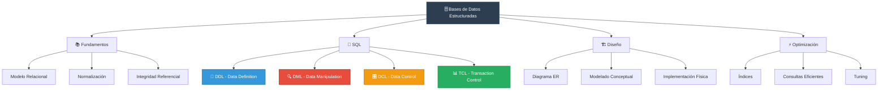

</div>

## 🎯 Objetivos de Aprendizaje

<table>
<tr>
<td width="50%">

### 🏗️ Fundamentos
- ✅ Modelo Relacional
- ✅ Normalización de datos
- ✅ Integridad referencial
- ✅ Álgebra relacional

</td>
<td width="50%">

### 🚀 Avanzado
- 🔥 Optimización de consultas
- 🔥 Administración de BD
- 🔥 Transacciones ACID
- 🔥 Procedimientos almacenados

</td>
</tr>
</table>

## 📊 Tecnologías y SGBD

<div align="center">

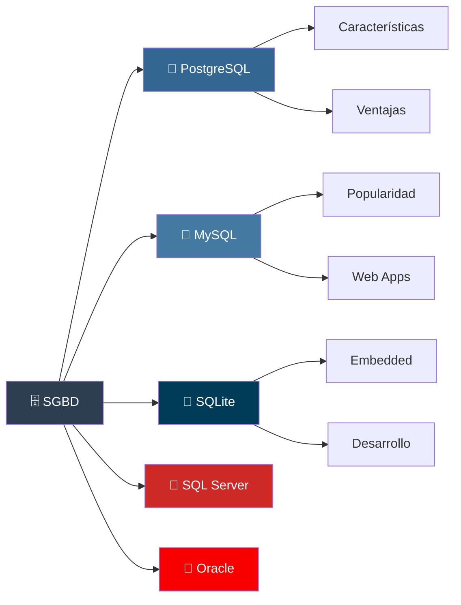

</div>

### 🛠️ Stack Tecnológico

<div align="center">

| Categoría | Tecnología | Propósito | Estado |
|-----------|------------|-----------|--------|
|  | PostgreSQL 13+ | BD Principal | ✅ |
|  | MySQL 8.0+ | BD Web | ✅ |
|  | SQLite 3+ | BD Desarrollo | ✅ |
|  | DBeaver | Cliente Universal | ✅ |
|  | phpMyAdmin | MySQL Admin | ✅ |

</div>

## 📚 Estructura del Curso

<div align="center">

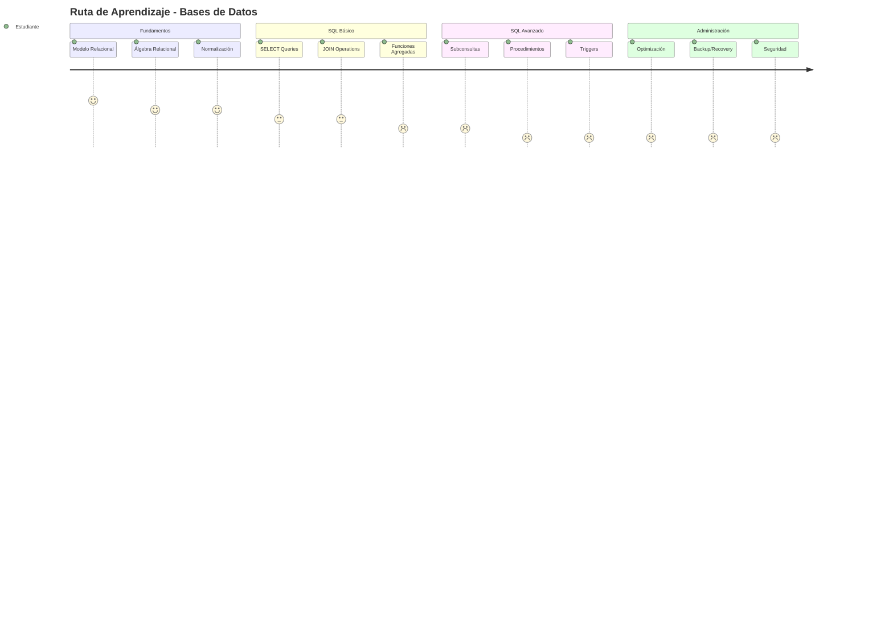

</div>

### 📁 Organización del Repositorio

<div align="center">

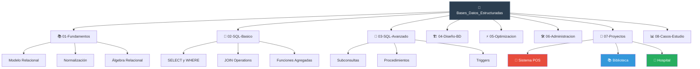

</div>

## 🗄️ Modelo de Datos - Ejemplo E-commerce

<div align="center">

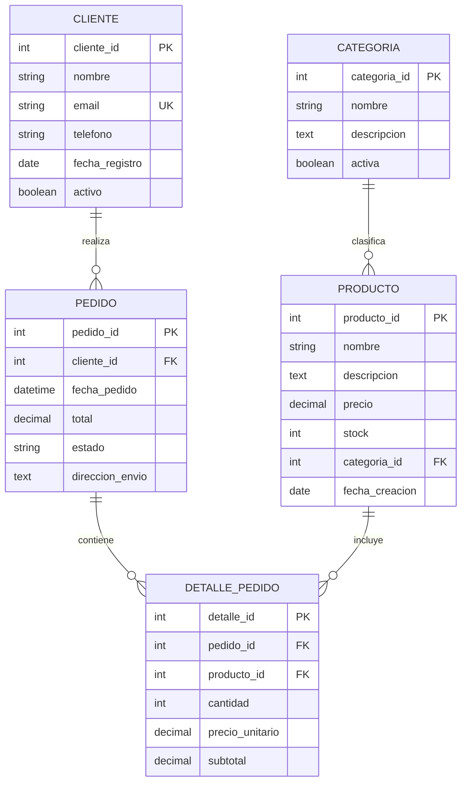

</div>

## 🚀 Quick Start

<div align="center">

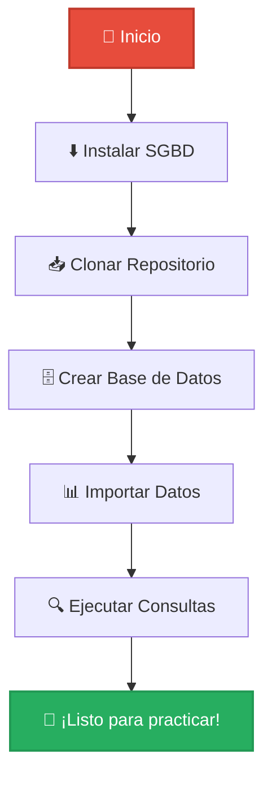

</div>

### 💻 Instalación y Configuración

```bash
# 1️⃣ Clonar el repositorio
git clone https://github.com/Arkanabytes/Bases_Datos_Estructuradas.git

# 2️⃣ Navegar al directorio
cd Bases_Datos_Estructuradas

# 3️⃣ Instalar PostgreSQL (Ubuntu/Debian)
sudo apt update
sudo apt install postgresql postgresql-contrib

# 4️⃣ Configurar usuario PostgreSQL
sudo -u postgres createuser --interactive

# 5️⃣ Crear base de datos de práctica
createdb practica_bd

# 6️⃣ Conectar y ejecutar scripts
psql -d practica_bd -f scripts/schema.sql
psql -d practica_bd -f scripts/data.sql
```

### 🔧 Para MySQL
```bash
# Instalar MySQL
sudo apt install mysql-server

# Configurar seguridad
sudo mysql_secure_installation

# Crear base de datos
mysql -u root -p -e "CREATE DATABASE practica_bd;"

# Importar esquema
mysql -u root -p practica_bd < scripts/mysql_schema.sql
```

## 📖 Ejemplos Prácticos de SQL

### 🟢 Consultas Básicas (SELECT)
```sql
-- 📊 Consulta simple con filtros
SELECT 
    p.nombre,
    p.precio,
    c.nombre AS categoria
FROM productos p
INNER JOIN categorias c ON p.categoria_id = c.categoria_id
WHERE p.precio BETWEEN 100 AND 500
ORDER BY p.precio DESC;

-- 📈 Funciones agregadas
SELECT 
    c.nombre AS categoria,
    COUNT(*) AS total_productos,
    AVG(p.precio) AS precio_promedio,
    MIN(p.precio) AS precio_minimo,
    MAX(p.precio) AS precio_maximo
FROM productos p
INNER JOIN categorias c ON p.categoria_id = c.categoria_id
GROUP BY c.categoria_id, c.nombre
HAVING COUNT(*) > 5;
```

### 🟡 Consultas Intermedias (JOINs Complejos)
```sql
-- 🔍 JOIN múltiple con subconsulta
SELECT 
    cl.nombre AS cliente,
    COUNT(p.pedido_id) AS total_pedidos,
    SUM(p.total) AS gasto_total,
    ROUND(AVG(p.total), 2) AS gasto_promedio
FROM clientes cl
LEFT JOIN pedidos p ON cl.cliente_id = p.cliente_id
WHERE cl.fecha_registro >= '2023-01-01'
GROUP BY cl.cliente_id, cl.nombre
HAVING SUM(p.total) > 1000
ORDER BY gasto_total DESC
LIMIT 10;
```

### 🔴 Consultas Avanzadas (Window Functions)
```sql
-- 🎯 Funciones de ventana y ranking
SELECT 
    p.nombre,
    c.nombre AS categoria,
    p.precio,
    ROW_NUMBER() OVER (PARTITION BY c.categoria_id ORDER BY p.precio DESC) as ranking_precio,
    DENSE_RANK() OVER (ORDER BY p.precio DESC) as ranking_general,
    LAG(p.precio) OVER (PARTITION BY c.categoria_id ORDER BY p.precio) as precio_anterior,
    precio - LAG(p.precio) OVER (PARTITION BY c.categoria_id ORDER BY p.precio) as diferencia_precio
FROM productos p
INNER JOIN categorias c ON p.categoria_id = c.categoria_id;
```

## 🏗️ Diseño de Base de Datos - Proceso

<div align="center">

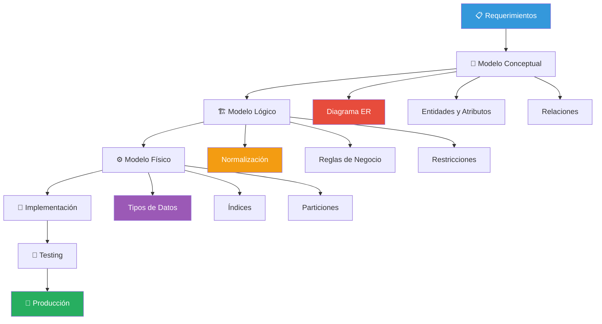

</div>

## 📊 Normalización - Formas Normales

<div align="center">

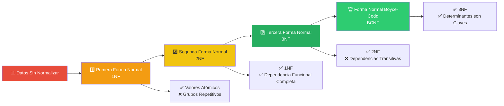

</div>

## ⚡ Optimización de Consultas

### 📈 Análisis de Performance

<div align="center">

| Técnica | Descripción | Impacto | Dificultad |
|---------|-------------|---------|------------|
|  | B-Tree, Hash | 🚀🚀🚀 | ⭐⭐ |
|  | Reescritura SQL | 🚀🚀 | ⭐⭐⭐ |
|  | Dividir tablas | 🚀🚀🚀 | ⭐⭐⭐⭐ |
|  | Resultados en memoria | 🚀🚀 | ⭐⭐ |

</div>

### 🔍 Plan de Ejecución
```sql
-- 📊 Analizar plan de ejecución
EXPLAIN ANALYZE
SELECT 
    c.nombre,
    COUNT(p.pedido_id) as total_pedidos,
    SUM(dp.cantidad * dp.precio_unitario) as total_ventas
FROM clientes c
JOIN pedidos p ON c.cliente_id = p.cliente_id
JOIN detalle_pedido dp ON p.pedido_id = dp.pedido_id
WHERE p.fecha_pedido BETWEEN '2023-01-01' AND '2023-12-31'
GROUP BY c.cliente_id, c.nombre
ORDER BY total_ventas DESC;

-- 🚀 Crear índice para optimización
CREATE INDEX idx_pedidos_fecha_cliente 
ON pedidos(fecha_pedido, cliente_id);
```

## 🎯 Proyectos Incluidos

<div align="center">

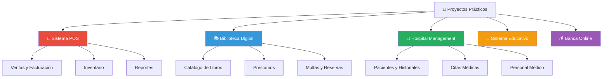

</div>

### 🏪 Sistema POS - Arquitectura de BD

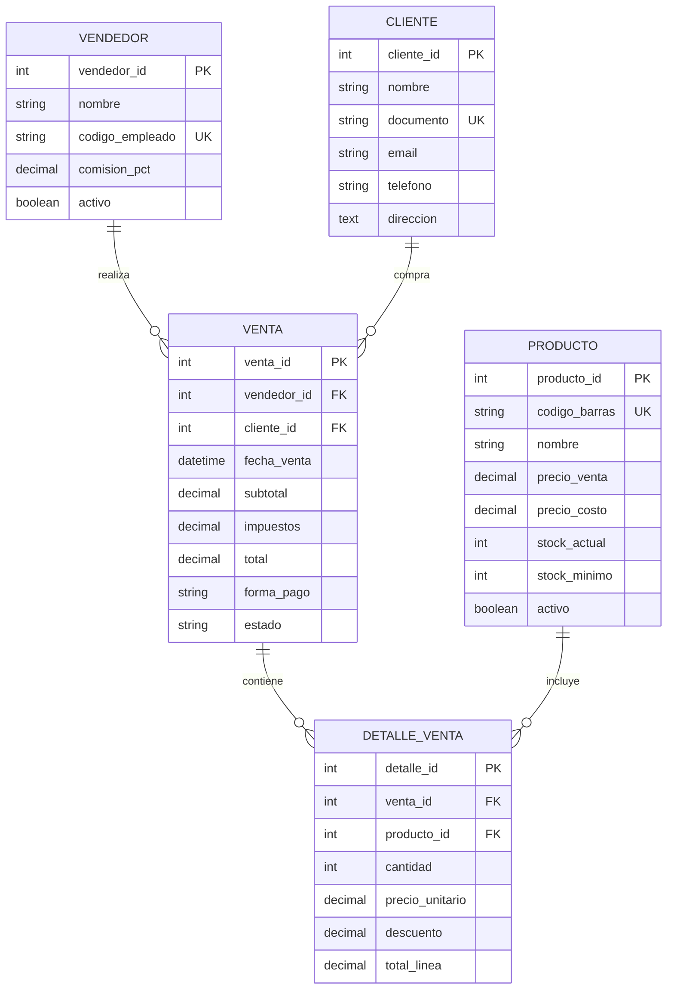

## 🧪 Testing y Validación

<div align="center">


</div>

### 🔧 Scripts de Testing
```sql
-- 🧪 Test de integridad referencial
DO $$
BEGIN
    -- Test: Verificar que no existan pedidos sin cliente
    IF EXISTS (
        SELECT 1 FROM pedidos p 
        LEFT JOIN clientes c ON p.cliente_id = c.cliente_id 
        WHERE c.cliente_id IS NULL
    ) THEN
        RAISE EXCEPTION 'Test FAILED: Existen pedidos sin cliente válido';
    END IF;
    
    -- Test: Verificar consistencia de totales
    IF EXISTS (
        SELECT 1 FROM pedidos p
        WHERE p.total != (
            SELECT SUM(dp.cantidad * dp.precio_unitario) 
            FROM detalle_pedido dp 
            WHERE dp.pedido_id = p.pedido_id
        )
    ) THEN
        RAISE EXCEPTION 'Test FAILED: Inconsistencia en totales de pedidos';
    END IF;
    
    RAISE NOTICE 'Todos los tests de integridad PASARON ✅';
END $$;
```

## 📚 Casos de Estudio

<div align="center">

| Caso | Industria | Complejidad | Tecnología |
|------|-----------|-------------|------------|
| 🛒 E-commerce | Retail | ⭐⭐⭐ | PostgreSQL |
| 🏥 Hospital | Salud | ⭐⭐⭐⭐ | SQL Server |
| 🏫 Universidad | Educación | ⭐⭐⭐ | MySQL |
| 🏦 Banco | Finanzas | ⭐⭐⭐⭐⭐ | Oracle |
| 📺 Streaming | Media | ⭐⭐⭐⭐ | PostgreSQL |

</div>

## 🗓️ Roadmap de Desarrollo

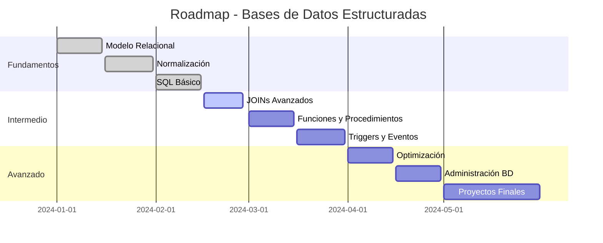

## 🛠️ Herramientas y Utilidades

### 📊 Clientes de Base de Datos

<div align="center">

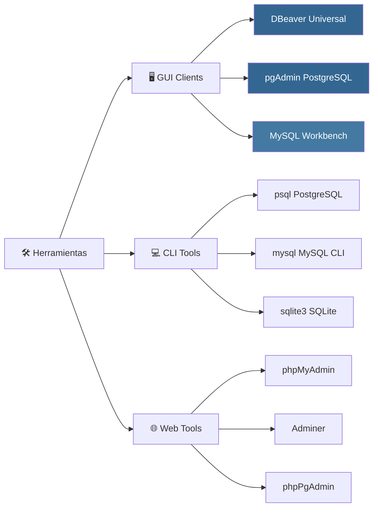

</div>

### ⚙️ Scripts de Automatización

```bash
#!/bin/bash
# 🔧 Script de backup automático

DB_NAME="practica_bd"
BACKUP_DIR="/backup/database"
DATE=$(date +%Y%m%d_%H%M%S)
BACKUP_FILE="$BACKUP_DIR/${DB_NAME}_$DATE.sql"

# Crear directorio si no existe
mkdir -p $BACKUP_DIR

# Realizar backup
pg_dump -h localhost -U postgres $DB_NAME > $BACKUP_FILE

# Comprimir backup
gzip $BACKUP_FILE

echo "✅ Backup completado: ${BACKUP_FILE}.gz"

# Limpiar backups antiguos (mantener últimos 7 días)
find $BACKUP_DIR -name "*.sql.gz" -mtime +7 -delete
```

## 🤝 Contribuir al Proyecto

<div align="center">


</div>

### 📋 Guías de Contribución

1. **🍴 Fork** el repositorio
2. **🌿 Crea** tu rama (`git checkout -b feature/nueva-funcionalidad`)
3. **💾 Desarrolla** siguiendo las convenciones SQL
4. **🧪 Prueba** tus consultas en diferentes SGBD
5. **📝 Documenta** tus cambios y ejemplos
6. **🚀 Sube** tus cambios (`git push origin feature/nueva-funcionalidad`)
7. **📬 Abre** un Pull Request con descripción detallada

### ✅ Checklist para Contribuciones

- [ ] ✅ Código SQL compatible con PostgreSQL/MySQL
- [ ] 📖 Documentación clara y ejemplos
- [ ] 🧪 Tests de validación incluidos
- [ ] 🎯 Casos de uso prácticos
- [ ] 📊 Diagramas ER cuando sea necesario
- [ ] ⚡ Consideraciones de performance

## 📊 Estadísticas del Proyecto

<div align="center">


</div>

## 📄 Licencia

<div align="center">

[](https://opensource.org/licenses/MIT)

</div>

Este proyecto está bajo la **Licencia MIT** - consulta el archivo [LICENSE](LICENSE) para más detalles.

## 👨‍💻 Autor

<div align="center">


**Arkanabytes**

[](https://github.com/Arkanabytes)
[](mailto:tu-email@ejemplo.com)
[](https://linkedin.com/in/tu-perfil)

</div>

## 🌟 Agradecimientos Especiales

<div align="center">

```mermaid
mindmap
  root((🙏 Gracias))
    🗄️ Comunidad DB
      PostgreSQL Team
      MySQL Developers
      SQLite Authors
    📚 Recursos
      W3Schools SQL
      SQLBolt
      DB-Engines
    🛠️ Her
